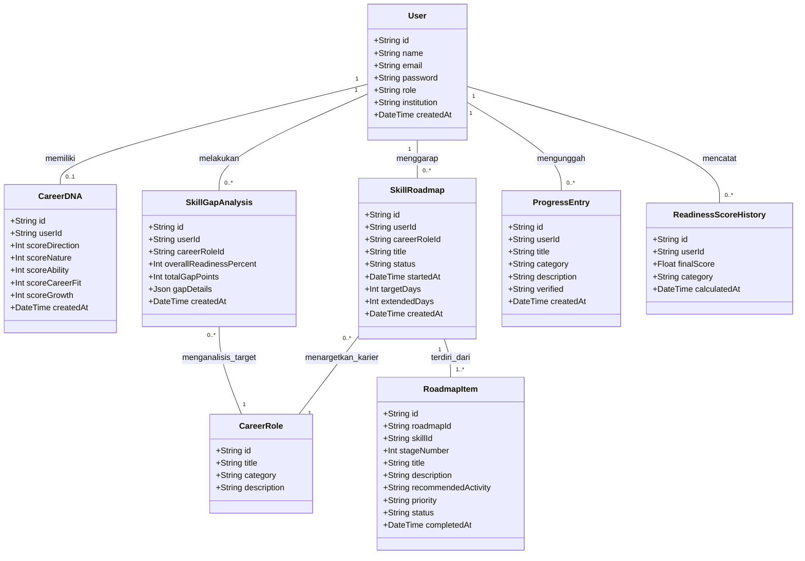

# Spesifikasi Kebutuhan Perangkat Lunak (SKPL)

## Dokumen Rekayasa Perangkat Lunak: Mind Passport
**Sistem Paspor Kompetensi & Kesiapan Karier Otonom Berbasis AI**

* **Versi:** 1.0 (Disetujui)
* **Tanggal:** 22 Juli 2026
* **Penyusun:** Tim Pengembang Mind Passport
* **Institusi:** Program Studi Teknik Informatika / Sistem Informasi

---

## Daftar Isi
1. **Pendahuluan**
   * 1.1 Tujuan Penulisan Dokumen
   * 1.2 Audien yang Dituju dan Pembaca yang Disarankan
   * 1.3 Batasan Produk
   * 1.4 Definisi dan Istilah
   * 1.5 Referensi
2. **Deskripsi Keseluruhan**
   * 2.1 Deskripsi Produk
   * 2.2 Fungsi Produk
   * 2.3 Penggolongan Karakteristik Pengguna
   * 2.4 Lingkungan Operasi
   * 2.5 Batasan Desain dan Implementasi
   * 2.6 Dokumentasi Pengguna
3. **Kebutuhan Antarmuka Eksternal**
   * 3.1 User Interfaces (Antarmuka Pengguna)
   * 3.2 Hardware Interface (Antarmuka Perangkat Keras)
   * 3.3 Software Interface (Antarmuka Perangkat Lunak)
   * 3.4 Communication Interface (Antarmuka Komunikasi)
4. **Kebutuhan Fungsional (Functional Requirements)**
   * 4.1 Use Case Diagram
   * 4.2 Deskripsi Use Case (Stimulus & Respon)
   * 4.3 Class Diagram
5. **Kebutuhan Non-Fungsional (Non-Functional Requirements)**
   * 5.1 Parameter Kebutuhan Non-Fungsional
   * 5.2 Catatan & Batasan Operasional

---

## 1. Pendahuluan

### 1.1 Tujuan Penulisan Dokumen
Dokumen Spesifikasi Kebutuhan Perangkat Lunak (SKPL) ini ditulis dengan tujuan untuk:
1. Mendefinisikan secara formal kebutuhan fungsional dan non-fungsional dari perangkat lunak **Mind Passport**.
2. Memberikan panduan teknis yang jelas bagi tim pengembang (*developer*), perancang sistem (*system designer*), penguji (*tester*), dan dosen penguji untuk memverifikasi kesesuaian implementasi sistem dengan spesifikasi rancangan.
3. Memastikan integrasi antara 8 fitur inti (Career DNA, Skill Gap, Roadmap, Progress Tracker, Readiness Score, Passport QR Code, AI Navigator, dan Industry Match) dapat diukur secara konsisten.

### 1.2 Audien yang Dituju dan Pembaca yang Disarankan
Dokumen ini ditujukan untuk:
* **Tim Pengembang (Software Engineer):** Sebagai acuan utama implementasi basis kode (Next.js 15, Prisma ORM, PostgreSQL).
* **Analis Sistem & Desainer UI/UX:** Untuk memvalidasi alur navigasi dan tata letak visual responsif mobile-first.
* **Tim Penjamin Mutu (Quality Assurance/Tester):** Untuk menyusun skenario pengujian unit, integrasi, dan penerimaan pengguna (UAT).
* **Dosen Penguji / Reviewer:** Sebagai dokumen evaluasi pertanggungjawaban akademis mengenai arsitektur perangkat lunak yang dikembangkan.

### 1.3 Batasan Produk
Sistem **Mind Passport** dirancang sebagai aplikasi web berbasis *Next.js 15 App Router*. Batasan operasional sistem meliputi:
* **Autentikasi:** Menggunakan session berbasis cookies terenkripsi (Next-Auth / Prisma Adapter). Tidak bergantung pada database eksternal di luar PostgreSQL.
* **AI Engine:** Pemrosesan otonom menggunakan Gemini 1.5 API dengan mekanisme *algorithm fallback* terstruktur jika terjadi kegagalan/timeout API dalam waktu 4 detik.
* **QR Code & Passport:** QR Code yang dihasilkan bersifat statis-dinamis yang mengarah pada URL publik terenkripsi (Format URL: `/passport/[slug]`).
* **Responsif:** Tampilan UI bersifat *mobile-first* (berorientasi pada perangkat mobile/ponsel pintar) dengan skema navigasi *bottom nav* khusus pelajar dan *amber banner* untuk administrator.

### 1.4 Definisi dan Istilah
* **SKPL / SRS:** Spesifikasi Kebutuhan Perangkat Lunak / *Software Requirements Specification*.
* **Career DNA:** Asesmen potensi diri yang mengukur 5 dimensi (Direction, Nature, Ability, Career Fit, Growth Potential).
* **Skill Gap Analysis:** Komparasi matematis antara tingkat keahlian riil pengguna dengan standar minimum industri.
* **Career Readiness Score (CRS):** Indeks angka kesiapan kerja (0-100) yang dihasilkan melalui perhitungan bobot kontribusi instrumen internal.
* **Digital Competency Passport:** Dokumen digital terverifikasi dengan ID unik berformat `MP-YYYY-MM-XXXXXX` yang memuat rangkuman sertifikasi, keahlian, dan tautan publik yang dapat divalidasi via QR Code.

### 1.5 Referensi
1. IEEE Std 830-1998, *IEEE Recommended Practice for Software Requirements Specifications*.
2. Dokumentasi Teknis Next.js 15 dan React 19 (React Server Components).
3. Dokumentasi Prisma ORM untuk PostgreSQL.
4. Panduan Integrasi Google Gemini AI Developer SDK.

---

## 2. Deskripsi Keseluruhan

### 2.1 Deskripsi Produk
**Mind Passport** adalah ekosistem digital otonom untuk membantu mahasiswa dan lulusan baru dalam memetakan, melacak, dan memvalidasi kesiapan karier mereka. 

Sistem ini memandu pengguna secara terstruktur mulai dari pendaftaran akun, pengisian asesmen kepribadian/minat (Career DNA), analisis gap terhadap target profesi industri, penyusunan kurikulum belajar mandiri (Roadmap), pelacakan progres fisik sertifikat (Progress Tracker), kalkulasi kesiapan kerja terpadu (Readiness Score), konsultasi AI (Navigator), hingga penerbitan paspor kompetensi digital ber-QR Code untuk kebutuhan rekrutmen industri.

### 2.2 Fungsi Produk
Fungsi utama yang disediakan oleh Mind Passport meliputi:
1. **Sistem Autentikasi Peran:** Autentikasi aman untuk akun Siswa (User) dan Admin.
2. **Career DNA Assessment:** Pengisian asesmen 5 dimensi dengan kalkulasi otomatis dan visualisasi diagram radar.
3. **Analisis Kesenjangan (Skill Gap):** Perbandingan keahlian pengguna dengan parameter acuan standar industri.
4. **Roadmap Pembelajaran Mandiri (Personalized Roadmap):** Penyusunan tahap belajar otonom, penghitungan waktu belajar (elapsed time), dan penambahan masa durasi target belajar (+7/+14 hari).
5. **Pelacak Progres Pembelajaran (Progress Tracker):** Media pengunggahan bukti portofolio/sertifikat yang siap dinilai.
6. **Skor Kesiapan Karier (CRS):** Penghitungan real-time indeks kesiapan kerja dari bobot DNA, Gap, Roadmap, dan Aktivitas.
7. **Paspor Kompetensi Digital & QR Code:** Halaman publik paspor kompetensi siswa yang dilengkapi generator QR Code kontras tinggi.
8. **Asisten Karier Otonom (AI Navigator):** Chatbot interaktif bertenaga LLM Gemini untuk rekomendasi dan bimbingan karier terintegrasi.
9. **Verifikasi Progres (Admin):** Panel kendali admin untuk menyetujui/menolak bukti sertifikasi siswa secara instan.
10. **Pengaturan Standar Kompetensi (Admin):** Panel admin untuk memperbarui nilai standar minimal tiap profesi industri.

### 2.3 Penggolongan Karakteristik Pengguna
Sistem membedakan pengguna ke dalam dua kategori peran (*role*):

#### Tabel 1. Karakteristik Pengguna
| Kategori Pengguna | Tugas Utama | Hak Akses Sistem | Kemampuan yang Harus Dimiliki |
| :--- | :--- | :--- | :--- |
| **Siswa (User)** | Mengisi Career DNA, menganalisis gap keahlian, memantau roadmap, mengunggah bukti progres, melihat skor CRS, mengonsultasikan karier pada AI, dan membagikan tautan paspor digital. | Mengakses seluruh fitur beranda mahasiswa (`/dashboard`, `/career-dna`, `/skill-gap`, `/roadmap`, `/progress`, `/readiness-score`, `/passport`, `/navigator`, `/industry-match`). | Pengoperasian browser web dasar pada smartphone atau komputer desktop. |
| **Administrator (Admin)** | Memverifikasi berkas portofolio siswa, mengelola standar kebutuhan keahlian industri, memantau daftar pengguna terdaftar, dan mengaudit riwayat log login. | Mengakses panel kontrol admin (`/admin/verify`, `/admin/standards`, `/admin/users`, `/admin/logs`). | Pengoperasian sistem manajemen data berbasis web. |

### 2.4 Lingkungan Operasi
Perangkat lunak Mind Passport beroperasi pada lingkungan berikut:
* **Server Side:** Node.js v18.x ke atas, Next.js 15, Prisma ORM, dengan database PostgreSQL (Neon Database Serverless).
* **Client Side:** Browser web modern yang mendukung JavaScript ES6 dan HTML5 (Google Chrome, Mozilla Firefox, Safari, Microsoft Edge, Opera).
* **Sistem Operasi Host Server:** Linux (Ubuntu Server, Alpine Linux) atau platform Serverless Cloud (Vercel, AWS Amplify).

### 2.5 Batasan Desain dan Implementasi
* **Desain UI:** Harus responsif menggunakan Tailwind CSS dengan layout *mobile-first* (Drawer menu menyusut menjadi bottom navigation bar di layar ponsel).
* **Manajemen Keadaan (State Management):** Menggunakan React hooks (`useState`, `useEffect`) dan Next.js server actions.
* **Database Relasional:** Struktur database harus mematuhi skema relasi integritas referensial (Foreign Key, Cascade Delete).

### 2.6 Dokumentasi Pengguna
Paket perangkat lunak ini disertai dengan dokumentasi pengguna berupa:
1. **Panduan Penggunaan Siswa (User Guide):** PDF tutorial interaktif pengisian data, pembacaan radar chart, dan penggunaan QR Code paspor.
2. **Panduan Operasional Administrator (Admin Manual):** Panduan tata cara memverifikasi berkas, memperbarui standar profesi, dan memantau audit log.
3. **Naskah Demo Resmi (`PRESENTATION_DEMO_SCRIPT.md`):** Naskah panduan skenario demo presentasi 10 menit.

---

## 3. Kebutuhan Antarmuka Eksternal

### 3.1 User Interfaces
Antarmuka pengguna didesain dengan visualisasi modern:
* **Warna Utama (Siswa):** Indigo (#4F46E5), Sky Blue (#0EA5E9), dengan latar belakang netral/putih pada dashboard dan gradien gelap pada halaman autentikasi.
* **Warna Utama (Admin):** Skema warna Amber/Kuning Gelap (#D97706) dikombinasikan dengan latar belakang gelap (*Dark Amber Theme*) dan spanduk penunjuk status mode admin aktif di bagian atas.
* **Grafik Visual:** Menggunakan library Recharts untuk visualisasi diagram radar (5 dimensi DNA) dan diagram batang (Perbandingan skor gap).
* **Navigasi Responsif:** Tombol navigasi melayang (*sticky bottom navigation*) di layar perangkat genggam agar mudah dijangkau oleh jempol pengguna.

### 3.2 Hardware Interface
Aplikasi dijalankan pada perangkat keras berikut:
* **Sisi Server (Server-side Hosting):** Processor 1 vCPU, RAM 512 MB, Storage 1 GB (minimum spesifikasi cloud serverless / container base).
* **Sisi Pengguna (Client-side Devices):**
  * PC/Laptop dengan RAM minimal 2 GB dan resolusi layar minimal 1024x768.
  * Smartphone dengan memori RAM minimal 1 GB dan layar touchscreen.
  * Kamera smartphone (diperlukan bagi pihak ketiga untuk memindai QR Code kompetensi paspor fisik).

### 3.3 Software Interface
Sistem berinteraksi dengan komponen perangkat lunak eksternal berikut:
* **Sistem Operasi Client:** Windows, Linux, macOS, Android, iOS.
* **Prisma Client:** Sebagai antarmuka query database PostgreSQL.
* **Google Gemini AI API:** Digunakan untuk memberikan analisis konsultasi karier otonom secara *real-time*.
* **Next-Auth:** Untuk koordinasi sesi autentikasi pengguna melalui enkripsi cookie browser.

### 3.4 Communication Interface
* Protokol komunikasi data menggunakan **HTTPS** (wajib pada tahap produksi) untuk mengamankan data pengguna, sandi, dan transaksi dokumen paspor.
* Antarmuka pertukaran data API menggunakan format **JSON** via arsitektur RESTful API (`/api/roadmap`, `/api/readiness-score`, `/api/passport/qrcode`).

---

## 4. Kebutuhan Fungsional (Functional Requirements)

#### Tabel 2. Kebutuhan Fungsional Perangkat Lunak
| ID | Kebutuhan Fungsional | Penjelasan Deskripsi |
| :--- | :--- | :--- |
| **FR-01** | Pendaftaran dan Autentikasi Pengguna | Sistem memfasilitasi registrasi siswa baru dan login multi-peran (Siswa/Admin) dengan aman. |
| **FR-02** | Pengisian Career DNA Assessment | Sistem menyajikan kuesioner 5 dimensi dan menampilkan radar chart hasil analisis potensi siswa. |
| **FR-03** | Analisis Kesenjangan Keahlian (Skill Gap) | Sistem menghitung selisih keahlian siswa dengan target industri dan menyajikan bar chart perbandingan. |
| **FR-04** | Pembuatan & Pengelolaan Roadmap Belajar | Sistem menyusun langkah belajar otonom, mengaktifkan pengerjaan, menghitung elapsed time, dan melayani penambahan durasi (+7/+14 Hari). |
| **FR-05** | Pengunggahan Bukti Progres Pembelajaran | Siswa mengunggah sertifikat/proyek ke sistem tracker dengan status awal ditinjau (pending). |
| **FR-06** | Rekalibrasi Skor Kesiapan (Readiness Score) | Sistem menghitung Career Readiness Score secara otonom (0-100) setiap kali ada data perkembangan baru yang disetujui. |
| **FR-07** | Penerbitan Paspor Digital & QR Code | Sistem mencetak paspor digital ber-ID unik lengkap dengan QR Code kontras tinggi yang dapat di-scan publik. |
| **FR-08** | Konsultasi AI Karier (Navigator) | Sistem menyediakan ruang chat interaktif berbasis LLM Gemini untuk konsultasi karier terpandu. |
| **FR-09** | Panel Kendali Verifikasi (Admin) | Admin dapat menyetujui atau menolak bukti sertifikat siswa yang berstatus ditinjau secara instan. |
| **FR-10** | Konfigurasi Standar Kompetensi (Admin) | Admin dapat merubah skor target minimal tiap profesi industri di database. |
| **FR-11** | Audit Log Keamanan (Admin) | Admin dapat melihat riwayat log masuk sistem dan memantau status aktivitas keamanan. |

---

### 4.1 Use Case Diagram

Diagram Use Case menggambarkan interaksi antara Aktor (Siswa dan Admin) dengan fungsi-fungsi utama dalam sistem Mind Passport.

```mermaid
usecaseDiagram
    actor Siswa as "Siswa (User)"
    actor Admin as "Administrator"

    Siswa --> (Registrasi & Login)
    Siswa --> (Mengisi Career DNA Assessment)
    Siswa --> (Melakukan Skill Gap Analysis)
    Siswa --> (Mengelola Skill Roadmap & Tambah Waktu)
    Siswa --> (Mengunggah Bukti Progress Tracker)
    Siswa --> (Melihat Career Readiness Score)
    Siswa --> (Mengakses Paspor Digital & QR Code)
    Siswa --> (Konsultasi via AI Career Navigator)

    Admin --> (Registrasi & Login)
    Admin --> (Memverifikasi Bukti Progres Siswa)
    Admin --> (Mengelola Standar Kompetensi Industri)
    Admin --> (Mengelola Pengguna & Audit Logs)
```

---

### 4.2 Deskripsi Use Case (Stimulus & Respon)

Berikut adalah detail interaksi masukan (stimulus) dari aktor dan tanggapan (respon) dari sistem untuk use case kritis:

#### 4.2.1 Use Case: Mengelola Skill Roadmap & Tambah Waktu
* **ID Use Case:** UC-04
* **Aktor Utama:** Siswa (User)
* **Deskripsi:** Siswa mengaktifkan roadmap belajarnya, melacak lama waktu belajar berjalan, dan meminta perpanjangan durasi target penyelesaian.
* **Stimulus dan Respon:**

| Aktor (User) | Respon Sistem |
| :--- | :--- |
| 1. Memilih menu 'Roadmap' di sidebar navigasi. | 2. Memuat data roadmap yang aktif milik pengguna dari database PostgreSQL. |
| 3. Menekan tombol **'▶️ Mulai Roadmap'** jika belum dimulai. | 4. Menyimpan waktu *startedAt* ke database, menghitung durasi pengerjaan berjalan (*elapsed time*), dan memperbarui tampilan kartu secara dinamis. |
| 5. Menekan tombol **'➕ +7 Hari'** atau **'+14 Hari'** untuk memperpanjang target waktu selesai. | 6. Menghitung akumulasi tanggal target baru, memperbarui *extendedDays* di database, dan memuat ulang info tanggal target selesai tanpa memuat ulang browser (*SPA transition*). |
| 7. Mengklik checkbox salah satu langkah pembelajaran untuk diubah statusnya menjadi **'Selesai (Done)'**. | 8. Memperbarui status item menjadi *done*, merekalibrasi ulang *Career Readiness Score* pengguna, dan memicu pembaruan widget CRS di sidebar secara dinamis. |

#### 4.2.2 Use Case: Memverifikasi Bukti Progres Siswa
* **ID Use Case:** UC-09
* **Aktor Utama:** Administrator
* **Deskripsi:** Admin meninjau data bukti fisik sertifikasi siswa dan mengubah statusnya dari ditinjau menjadi disetujui (verifikasi).
* **Stimulus dan Respon:**

| Aktor (Admin) | Respon Sistem |
| :--- | :--- |
| 1. Memilih menu 'Verifikasi' di panel admin. | 2. Memuat daftar bukti aktivitas siswa yang berstatus '⏳ Ditinjau' (Pending) dari database. |
| 3. Menekan tombol **'✓ Verifikasi'** pada baris data siswa pilihan. | 4. Mengubah status *ProgressEntry* menjadi 'disetujui' (verified). |
| | 5. Memicu fungsi `updateReadinessScore(userId)` untuk menghitung ulang nilai CRS milik siswa tersebut dengan memasukkan bobot tambahan 20% dari aktivitas terverifikasi. |
| | 6. Memperbarui daftar verifikasi di antarmuka admin dan memindahkan entri ke kelompok data terverifikasi. |

#### 4.2.3 Use Case: Melakukan Skill Gap Analysis
* **ID Use Case:** UC-03
* **Aktor Utama:** Siswa (User)
* **Deskripsi:** Siswa membandingkan tingkat kemampuannya dengan kebutuhan nyata standar industri.
* **Stimulus dan Respon:**

| Aktor (User) | Respon Sistem |
| :--- | :--- |
| 1. Memilih menu 'Skill Gap' di navigasi. | 2. Menampilkan pilihan target karier (Default: profesi hasil rekomendasi Career DNA). |
| 3. Memilih target profesi dan menekan **'Mulai Analisis Gap'**. | 4. Menampilkan formulir asesmen mandiri untuk daftar keahlian wajib pada profesi tersebut. |
| 5. Mengisi tingkat keahlian saat ini (Skala 1-5) dan menekan **'Hitung Gap'**. | 6. Melakukan kalkulasi selisih skor, menyimpan hasil analisis ke database, menampilkan diagram batang perbandingan, dan memicu tombol buat roadmap. |

---

### 4.3 Class Diagram

Arsitektur database relasional Mind Passport direpresentasikan dalam bentuk Class Diagram (Entity Relationship) berikut:



---

## 5. Kebutuhan Non-Fungsional (Non-Functional Requirements)

Kebutuhan non-fungsional mendefinisikan batasan operasional, performa, dan keamanan dari sistem Mind Passport.

#### Tabel 3. Kebutuhan Non-Fungsional Perangkat Lunak
| ID | Parameter | Deskripsi Spesifikasi Kebutuhan |
| :--- | :--- | :--- |
| **NFR-01** | **Availability** | Sistem harus dapat diakses selama 24 jam sehari, 7 hari seminggu dengan target *uptime* minimal **99.9%**, kecuali selama jendela pemeliharaan resmi yang dijadwalkan di luar jam kerja aktif mahasiswa (Pukul 02:00 - 04:00 WIB). |
| **NFR-02** | **Reliability** | *AI Generator Fallback:* Jika koneksi API Gemini terputus atau mengalami kegagalan respons lebih dari **4 detik**, sistem harus otomatis mengalihkan proses pembuatan roadmap ke algoritma bawaan lokal server (*static template engine*) agar sistem tidak *crash* atau menampilkan halaman kosong. |
| **NFR-03** | **Ergonomy** | 1. Tampilan antarmuka harus responsif penuh (*fluid grid*), nyaman dibaca di layar berukuran 360px (mobile) hingga 1920px (monitor desktop).<br>2. Navigasi administrator dipisahkan secara visual menggunakan skema tema gelap (*Dark Amber*) dan banner penanda khusus untuk mencegah kesalahan operasional verifikasi data. |
| **NFR-04** | **Portability** | Sistem dapat diakses secara konsisten tanpa degradasi visual atau kegagalan fungsi di seluruh browser utama (Google Chrome, Firefox, Safari, Microsoft Edge) baik di platform sistem operasi desktop maupun mobile (Android/iOS). |
| **NFR-05** | **Memory & Storage** | Skema database dirancang modular dengan relasi terindeks untuk menjaga ukuran penyimpanan di bawah 100 MB untuk setiap 10.000 data pengguna aktif. |
| **NFR-06** | **Response Time** | 1. Setiap permintaan data static (landing page, dashboard) harus dimuat dalam waktu kurang dari **1.5 detik**.<br>2. Transisi status langkah roadmap dan pembaruan CRS wajib diselesaikan dalam waktu kurang dari **800 milidetik** pada antarmuka *client-side* (*Optimistic UI Update*). |
| **NFR-07** | **Safety** | Sistem tidak mengontrol perangkat fisik berbahaya, sehingga parameter keselamatan manusia dikategorikan sebagai *Not Applicable (N/A)*. |
| **NFR-08** | **Security** | 1. Enkripsi Kata Sandi: Sandi akun wajib dienkripsi satu arah menggunakan algoritma **bcrypt** dengan faktor kekuatan minimal 10.<br>2. Keamanan Sesi: Autentikasi sesi disimpan dalam *HTTP-only secure cookies* untuk mencegah serangan *Cross-Site Scripting (XSS)* dan *Session Hijacking*.<br>3. QR Code Verifikasi: URL tujuan pemindaian paspor harus diamankan menggunakan protokol **HTTPS** berkontras tinggi agar tidak mudah dipalsukan. |
| **NFR-09** | **Language** | Seluruh petunjuk, label tombol, panduan kuesioner, hasil analisis kesiapan, dan dokumentasi naskah harus disajikan menggunakan **Bahasa Indonesia** yang baik dan benar. |
