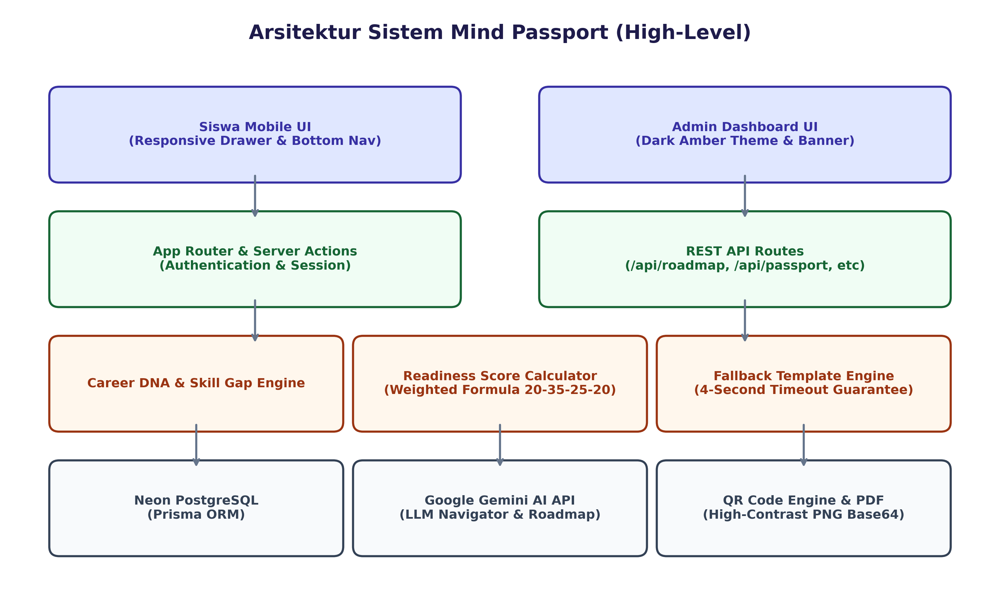
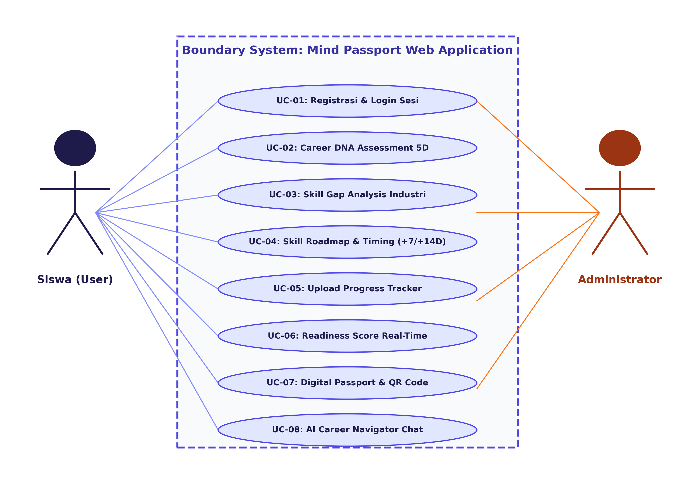
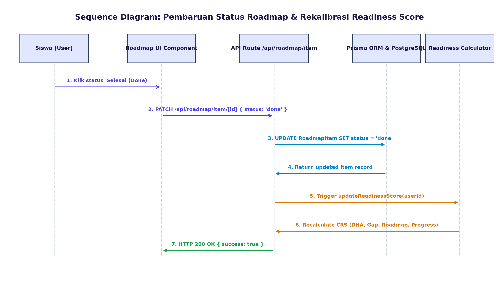
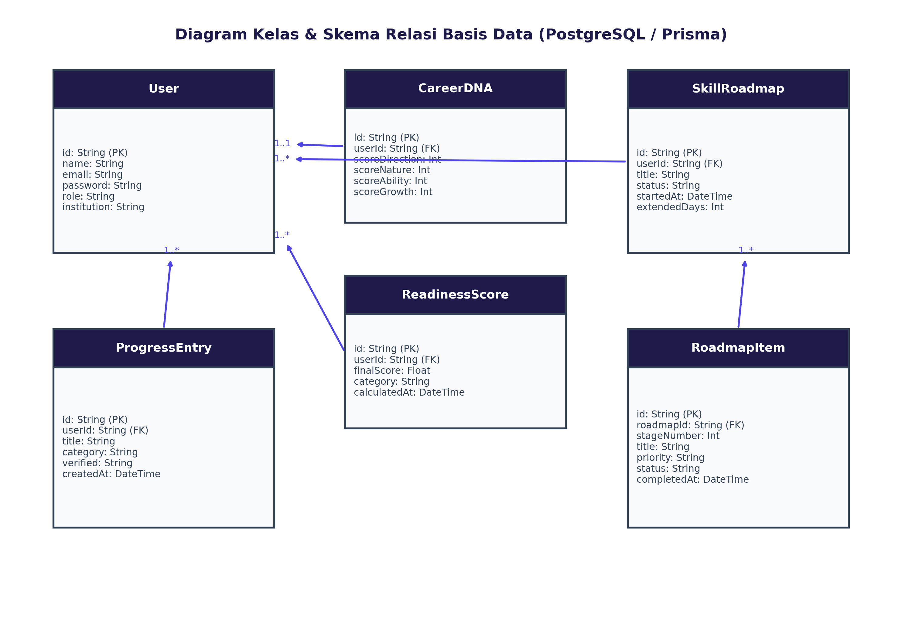

# Spesifikasi Kebutuhan Perangkat Lunak (SKPL)

## Dokumen Rekayasa Perangkat Lunak: Mind Passport
**Sistem Paspor Kompetensi & Kesiapan Karier Otonom Berbasis AI**

* **Standar Dokumen:** IEEE Std 830-1998
* **Versi Dokumen:** 1.0 (Final Approved)
* **Tanggal Penyusunan:** 22 Juli 2026
* **Penyusun:** Tim Pengembang Mind Passport
* **Institusi:** Program Studi Teknik Informatika / Sistem Informasi

---

*Gambar 0.1 Arsitektur Sistem Utama Mind Passport*

---

## Daftar Isi
1. **Pendahuluan**
   * 1.1 Tujuan Penulisan Dokumen
   * 1.2 Audien yang Dituju dan Pembaca yang Disarankan
   * 1.3 Batasan Produk (Product Scope)
   * 1.4 Definisi dan Istilah
   * 1.5 Referensi
2. **Deskripsi Keseluruhan**
   * 2.1 Deskripsi Produk
   * 2.2 Fungsi Utama Produk
   * 2.3 Penggolongan Karakteristik Pengguna
   * 2.4 Lingkungan Operasi (Operating Environment)
   * 2.5 Batasan Desain dan Implementasi
   * 2.6 Dokumentasi Pengguna
3. **Kebutuhan Antarmuka Eksternal**
   * 3.1 User Interfaces (Antarmuka Pengguna)
   * 3.2 Hardware Interfaces (Antarmuka Perangkat Keras)
   * 3.3 Software Interfaces (Antarmuka Perangkat Lunak)
   * 3.4 Communication Interfaces (Antarmuka Komunikasi & Kamus Data API)
4. **Kebutuhan Fungsional (Functional Requirements)**
   * 4.1 Daftar Kebutuhan Fungsional (FR-01 s.d FR-17)
   * 4.2 Use Case Diagram
   * 4.3 Spesifikasi Use Case Kritis (Stimulus & Respon)
   * 4.4 Sequence Diagram
   * 4.5 Class Diagram & ERD Basis Data
5. **Kebutuhan Non-Fungsional (Non-Functional Requirements)**
   * 5.1 Parameter Kebutuhan Non-Fungsional (NFR-01 s.d NFR-11)
   * 5.2 Lembar Pengesahan Dokumen

---

## 1. Pendahuluan

### 1.1 Tujuan Penulisan Dokumen
Dokumen Spesifikasi Kebutuhan Perangkat Lunak (SKPL) ini disusun secara komprehensif untuk mendefinisikan secara formal seluruh Kebutuhan Fungsional (*Functional Requirements*) dan Kebutuhan Non-Fungsional (*Non-Functional Requirements*) dari perangkat lunak **Mind Passport**. Dokumen ini dibuat berdasarkan standar internasional **IEEE Std 830-1998** dan bertindak sebagai kontrak teknis resmi antara tim pengembang (*developers*), perancang sistem (*system designers*), penguji (*quality assurance*), dan institusi / penguji akademis untuk memverifikasi kelayakan dan kualitas perangkat lunak.

Tujuan teknis khusus dokumen ini mencakup penguraian arsitektur 8 fitur inti (Career DNA, Skill Gap Analysis, Personalized Skill Roadmap, Learning Progress Tracker, Career Readiness Score, Digital Competency Passport, AI Career Navigator, dan Industry Fit Match) serta 3 modul pengelolaan admin agar seluruh proses pengkodean dan pengujian memiliki acuan empiris yang dapat diukur.

### 1.2 Audien yang Dituju dan Pembaca yang Disarankan
Dokumen SKPL ini dirancang khusus untuk memandu berbagai pemangku kepentingan (*stakeholders*) berikut:
* **Tim Pengembang (Software Engineer):** Memahami arsitektur Next.js 15 App Router, skema relasi PostgreSQL Prisma ORM, algoritma fallback 4 detik, dan RESTful API payload.
* **Perancang UI/UX & Analis Sistem:** Memvalidasi hirarki antarmuka visual responsif (*mobile-first*), sistem navigasi *bottom-bar*, dan skema tema Dark Amber untuk admin.
* **Penjamin Mutu (QA & Tester):** Menyusun skenario pengujian unit test, pengujian integrasi API, serta pengujian penerimaan pengguna (*User Acceptance Testing / UAT*).
* **Dosen Penguji & Reviewer:** Sebagai landasan penilai akademis dalam mengevaluasi pemenuhan spesifikasi teknis rekayasa perangkat lunak.

### 1.3 Batasan Produk (Product Scope)
Mind Passport adalah ekosistem digital otonom berbasis kecerdasan buatan yang berfokus pada pemetaan, pelacakan, dan pemastian kesiapan kerja mahasiswa serta fresh graduates. Batasan ruang lingkup aplikasi meliputi:
* **Autentikasi & Peran:** Sistem memproses autentikasi berbasis PostgreSQL dan enkripsi bcrypt tanpa ketergantungan database eksternal.
* **Kecerdasan Buatan (AI Engine):** Pengolahan AI menggunakan Google Gemini API 1.5 dengan jaminan fallback 4 detik ke *static template engine* jika terjadi kendala jaringan API.
* **Verifikasi QR Code:** QR Code yang dihasilkan berformat PNG base64 berkontras tinggi yang secara langsung mengarah pada tautan verifikasi paspor publik (`/passport/[slug]`).
* **Desain Antarmuka:** Antarmuka dibangun dengan pendekatan *mobile-first* responsif, menyediakan *drawer sidebar* pada layar lebar dan *bottom navigation bar* pada perangkat genggam.

### 1.4 Definisi dan Istilah
* **SKPL / SRS:** Spesifikasi Kebutuhan Perangkat Lunak / *Software Requirements Specification* berdasarkan standar IEEE Std 830-1998.
* **Career DNA:** Instrumen asesmen 5 dimensi (Direction, Nature, Ability, Career Fit, Growth Potential) untuk memetakan karakter dan potensi siswa.
* **Skill Gap Index:** Kalkulasi matematis yang membandingkan nilai keahlian siswa saat ini dengan standar minimum target profesi industri.
* **Career Readiness Score (CRS):** Indeks angka kesiapan kerja skala 0-100 yang dihitung dari bobot kombinasi 4 instrumen (DNA 20%, Gap 35%, Roadmap 25%, Progress 20%).
* **Digital Competency Passport:** Dokumen paspor kompetensi digital ber-ID unik (Format: `MP-YYYY-MM-XXXXXX`) yang memuat bukti keahlian terverifikasi dan dapat di-scan QR Code.

### 1.5 Referensi
1. IEEE Std 830-1998, *IEEE Recommended Practice for Software Requirements Specifications*.
2. Next.js 15 App Router & React 19 Server Components Documentation (https://nextjs.org/docs).
3. Prisma ORM & PostgreSQL Schema Architecture (https://www.prisma.io/docs).
4. Google Gemini AI Developer SDK Integration Manual.

---

## 2. Deskripsi Keseluruhan

### 2.1 Deskripsi Produk
Mind Passport dirancang sebagai solusi atas permasalahan kesenjangan keahlian (*skill gap*) yang sering dialami oleh lulusan baru perguruan tinggi. Aplikasi web ini mengintegrasikan seluruh alur pengembangan diri secara otonom: dimulai dari pengisian kuesioner potensi (Career DNA), analisis kekurangan skill terhadap target industri (Skill Gap), penyusunan kurikulum belajar mandiri bertahap (Roadmap), pelacakan portofolio bukti fisik (Progress Tracker), kalkulasi skor kesiapan kerja terpadu (Readiness Score), bimbingan konsultasi AI (Navigator), hingga penerbitan Paspor Kompetensi Digital yang terverifikasi dan siap di-scan oleh pihak rekruter industri.

### 2.2 Fungsi Utama Produk
Fungsi utama sistem terbagi dalam 8 modul siswa dan 3 modul kontrol administrator:
1. **Autentikasi Peran:** Registrasi akun baru dan login multi-role (Siswa & Admin) berbasis enkripsi bcrypt.
2. **Career DNA Assessment:** Kuesioner interaktif 5 dimensi dengan hasil visualisasi Diagram Radar 5D.
3. **Skill Gap Analysis:** Komparasi skor siswa vs standar industri dengan visualisasi Diagram Batang.
4. **Personalized Skill Roadmap:** Penyusunan modul belajar otonom, pelacakan waktu pengerjaan (*elapsed time*), dan tombol tambah durasi target (+7/+14 Hari).
5. **Verified Progress Tracker:** Media pengunggahan bukti fisik (sertifikat, magang, proyek) dengan status awal Ditinjau.
6. **Career Readiness Score:** Kalkulasi otomatis skor kesiapan kerja (0-100) dan grafik riwayat perkembangan mingguan.
7. **Digital Competency Passport:** Dokumen resmi ber-ID unik yang dilengkapi generator QR Code kontras tinggi dan tombol cetak PDF.
8. **AI Career Navigator:** Chatbot interaktif bertenaga LLM Gemini untuk konsultasi karier dan rekomendasi pelatihan.
9. **Verifikasi Progres Admin:** Panel kendali admin untuk menyetujui/menolak berkas sertifikasi siswa secara 1-klik.
10. **Manajemen Standar Industri:** Panel admin untuk merubah standar nilai minimum kompetensi profesi industri.
11. **Audit Logs & Keamanan:** Panel audit untuk memantau riwayat log login dan mendeteksi aktivitas mencurigakan.

### 2.3 Penggolongan Karakteristik Pengguna

| Kategori Pengguna | Tugas Utama | Hak Akses Aplikasi | Kemampuan yang Dibutuhkan |
| :--- | :--- | :--- | :--- |
| **Siswa (User)** | Mengisi Career DNA, menganalisis gap, mengelola roadmap & target waktu, mengupload portofolio, memantau skor CRS, konsultasi AI, dan membagikan QR Paspor. | Seluruh beranda mahasiswa (`/dashboard`, `/career-dna`, `/skill-gap`, `/roadmap`, `/progress`, `/readiness-score`, `/passport`, `/navigator`, `/industry-match`). | Pengoperasian web browser dasar di smartphone atau PC. |
| **Administrator** | Memverifikasi berkas sertifikat siswa, mengelola standar nilai industri, mengelola akun pengguna, dan memantau audit log login. | Seluruh panel admin (`/admin/verify`, `/admin/standards`, `/admin/users`, `/admin/logs`). | Pengoperasian web browser & manajemen data. |

### 2.4 Lingkungan Operasi (Operating Environment)
* **Server-Side:** Node.js v18+, Next.js 15 App Router, Prisma ORM v7, PostgreSQL (Neon DB Serverless).
* **Client-Side:** Browser web modern (Chrome 100+, Safari 15+, Firefox 100+, Edge) dengan dukungan JavaScript ES6+ dan HTML5 Canvas.
* **Cloud Infrastructure:** Vercel Cloud Serverless Deployment.

### 2.5 Batasan Desain dan Implementasi
1. **Responsive Layout:** Antarmuka dibangun dengan Tailwind CSS menggunakan prinsip *mobile-first* (Drawer sidebar menyusut menjadi bottom nav di ponsel).
2. **Optimistic State:** Setiap pembaruan status pengerjaan roadmap wajib diperbarui secara instan pada antarmuka client (*Optimistic UI*) sebelum server merespons.
3. **Admin Safety Visual:** Antarmuka admin diposisikan dalam tema gelap (*Dark Amber*) dan dilengkapi banner penanda status admin aktif.

### 2.6 Dokumentasi Pengguna
1. **Panduan Penggunaan Siswa (User Guide):** Tutorial langkah-langkah penggunaan dari pendaftaran hingga cetak PDF paspor digital.
2. **Panduan Operasional Admin (Admin Manual):** Panduan pengoperasian verifikasi berkas, pembaruan standar, dan analisis log.
3. **Naskah Demo Presentasi:** Naskah panduan pembacaan presentasi demo 10 menit (`PRESENTATION_DEMO_SCRIPT.md`).

---

## 3. Kebutuhan Antarmuka Eksternal

### 3.1 User Interfaces (Antarmuka Pengguna)
Antarmuka pengguna dirancang modern dan intuitif. Tampilan mahasiswa mendominasi skema warna Indigo (#4F46E5) dan Sky Blue (#0EA5E9) dengan visualisasi grafik interaktif Recharts. Tampilan administrator dipisahkan secara tegas menggunakan skema warna Dark Amber (#D97706) dan banner penanda mode admin aktif.

### 3.2 Hardware Interfaces (Antarmuka Perangkat Keras)
* **Server Hosting Specs:** vCPU 1 Core, RAM 512 MB, Disk Storage 1 GB.
* **Client Device Specs:** Laptop/PC RAM 2 GB (Min. Screen 1024x768) atau Smartphone Touchscreen RAM 1 GB (Min. Screen 360px).
* **Scanning Hardware:** Kamera HP beresolusi minimal 2 MP untuk pemindaian QR Code Paspor.

### 3.3 Software Interfaces (Antarmuka Perangkat Lunak)
* **Database Interface:** Prisma Client ORM untuk eksekusi query PostgreSQL.
* **AI Service Interface:** Google Gemini AI SDK 1.5 untuk pengolahan rekomendasi kecerdasan buatan.
* **Authentication Interface:** Next-Auth Session Manager untuk koordinasi cookie terenkripsi.

### 3.4 Communication Interfaces (Antarmuka Komunikasi & Kamus Data API)
Komunikasi data antara client browser dan server menggunakan arsitektur RESTful API berformat JSON yang diamankan dengan protokol HTTPS. Berikut adalah kamus data (*Data Dictionary*) untuk endpoint API utama:

| Endpoint API | Method | Request Payload (JSON) | Response Payload (JSON) |
| :--- | :--- | :--- | :--- |
| `/api/roadmap` | POST | `{"skillGapAnalysisId": "clx..."}` | `{"success": true, "data": {"id": "...", "title": "...", "items": [...]}}` |
| `/api/roadmap/[id]` | PATCH | `{"action": "start", "extendDays": 7}` | `{"success": true, "data": {"startedAt": "...", "extendedDays": 7}}` |
| `/api/roadmap/item/[id]` | PATCH | `{"status": "done"}` | `{"success": true, "data": {"id": "...", "status": "done"}}` |
| `/api/readiness-score/latest` | GET | None (Session Cookie) | `{"success": true, "data": {"score": 85, "category": "Sangat Siap"}}` |
| `/api/passport/qrcode` | GET | None (Session Cookie) | `{"success": true, "qrCodeUrl": "data:image/png;base64,..."}` |

---

## 4. Kebutuhan Fungsional (Functional Requirements)

### 4.1 Daftar Kebutuhan Fungsional

| ID | Fitur Fungsional | Deskripsi Detail Spesifikasi |
| :--- | :--- | :--- |
| **FR-01** | Pendaftaran Akun | Sistem memfasilitasi pendaftaran akun siswa baru dengan validasi email unik dan sandi terenkripsi bcrypt. |
| **FR-02** | Autentikasi Sesi | Sistem memverifikasi autentikasi masuk pengguna dan mengarahkan ke dashboard berdasarkan peran (Siswa/Admin). |
| **FR-03** | Career DNA Assessment | Sistem menyajikan kuesioner 5 dimensi dan menghitung skor potensi diri serta merekomendasikan target profesi. |
| **FR-04** | Visualisasi Radar Chart | Sistem menampilkan grafik radar 5 dimensi (Direction, Nature, Ability, Career Fit, Growth Potential) menggunakan Recharts. |
| **FR-05** | Skill Gap Analysis | Sistem membandingkan nilai keahlian siswa dengan standar minimum target industri dan mengelompokkan prioritas gap. |
| **FR-06** | Visualisasi Diagram Batang | Sistem menampilkan diagram batang perbandingan skor keahlian siswa melawan standar industri. |
| **FR-07** | Penyusunan Skill Roadmap | Sistem secara otonom menyusun modul belajar bertahap berdasarkan prioritas gap terbesar. |
| **FR-08** | Mulai Roadmap & Timing | Sistem menyediakan tombol '▶️ Mulai Roadmap' yang mencatat timestamp startedAt dan menghitung durasi pengerjaan berjalan (elapsed time). |
| **FR-09** | Perpanjangan Waktu Target | Sistem menyediakan tombol perpanjangan waktu '+7 Hari' dan '+14 Hari' yang memperbarui extendedDays dan tanggal target selesai. |
| **FR-10** | Progress Tracker | Siswa dapat mengunggah portofolio/sertifikat fisik dengan status awal 'Ditinjau'. |
| **FR-11** | Kalkulasi Readiness Score | Sistem merekalibrasi skor kesiapan kerja (0-100) secara otomatis setiap kali progres disetujui atau roadmap diselesaikan. |
| **FR-12** | Penerbitan Paspor Digital | Sistem menerbitkan paspor digital ber-ID unik berformat MP-YYYY-MM-XXXXXX. |
| **FR-13** | Generator QR Code | Sistem menghasilkan QR Code kontras tinggi (300px Base64 PNG) yang mengarah pada URL publik terverifikasi. |
| **FR-14** | AI Career Navigator | Sistem menyediakan chatbot konsultasi karier interaktif berbasis LLM Gemini. |
| **FR-15** | Panel Verifikasi Admin | Admin dapat menyetujui (1-klik) atau menolak bukti portofolio siswa. |
| **FR-16** | Manajemen Standar Industri | Admin dapat memperbarui skor standar minimum dan bobot kompetensi profesi industri. |
| **FR-17** | Audit Log Keamanan | Admin dapat memantau riwayat log masuk sistem dan statistik aktivitas pengusung sesi. |

### 4.2 Use Case Diagram

*Gambar 4.1 Diagram Use Case Mind Passport*

### 4.3 Spesifikasi Use Case Kritis (Stimulus & Respon)

#### 4.3.1 Use Case UC-04: Mengelola Skill Roadmap & Timing
* **Deskripsi:** Siswa mengaktifkan pengerjaan roadmap, melacak durasi belajar berjalan, memperpanjang durasi target, dan memperbarui status pengerjaan modul.
* **Pre-condition:** Siswa telah memiliki roadmap aktif hasil analisis Skill Gap.
* **Post-condition:** Status roadmap dan Career Readiness Score terbarui secara real-time.

| Stimulus (Aksi Siswa) | Respon Sistem |
| :--- | :--- |
| 1. Siswa memilih menu 'Roadmap' di sidebar navigasi. | 2. Memuat data roadmap aktif milik pengguna dari database PostgreSQL. |
| 3. Menekan tombol '▶️ Mulai Roadmap' jika belum dimulai. | 4. Menyimpan timestamp startedAt ke database, menghitung elapsed time, dan memperbarui kartu. |
| 5. Menekan tombol '➕ +7 Hari' atau '+14 Hari'. | 6. Menghitung tanggal target baru, memperbarui extendedDays, dan menampilkan tanggal target selesai baru. |
| 7. Mengklik status modul dari 'Belum' menjadi 'Selesai (Done)'. | 8. Memperbarui status modul menjadi done, merekalibrasi skor CRS, dan memperbarui widget CRS di sidebar. |

#### 4.3.2 Use Case UC-09: Verifikasi Progres Siswa (Admin)
* **Deskripsi:** Administrator meninjau dan menyetujui bukti portofolio / sertifikat yang diunggah oleh siswa.
* **Pre-condition:** Terdapat pengajuan berkas portofolio siswa berstatus Ditinjau.
* **Post-condition:** Status portofolio berubah menjadi Disetujui dan skor CRS siswa naik 20%.

| Stimulus (Aksi Admin) | Respon Sistem |
| :--- | :--- |
| 1. Admin memilih menu 'Verifikasi' di panel admin. | 2. Memuat daftar berkas siswa berstatus '⏳ Ditinjau'. |
| 3. Menekan tombol '✓ Verifikasi' pada entri siswa pilihan. | 4. Mengubah status berkas menjadi 'verified' di database. |
| | 5. Memicu fungsi updateReadinessScore(userId) untuk menaikkan skor CRS siswa sebesar 20%. |
| | 6. Memindahkan entri ke kelompok data terverifikasi. |

### 4.4 Sequence Diagram

*Gambar 4.2 Sequence Diagram Pembaruan Roadmap & Rekalibrasi Readiness Score*

### 4.5 Class Diagram & ERD Basis Data

*Gambar 4.3 Diagram Kelas & Relasi Database Mind Passport*

---

## 5. Kebutuhan Non-Fungsional (Non-Functional Requirements)

### 5.1 Parameter Kebutuhan Non-Fungsional

| ID | Parameter | Spesifikasi Detail Kebutuhan & Target Ukur |
| :--- | :--- | :--- |
| **NFR-01** | Availability | Sistem harus dapat diakses 24/7 dengan jaminan target uptime minimal 99.9%. |
| **NFR-02** | Reliability | Fallback Mechanism: Jika API Gemini timeout > 4 detik, sistem otomatis beralih menggunakan static template engine. |
| **NFR-03** | Ergonomy | Antarmuka responsif penuh (360px - 1920px). Panel admin dibedakan visual dengan skema tema gelap Dark Amber. |
| **NFR-04** | Portability | Dapat diakses secara konsisten di Chrome, Safari, Firefox, Edge pada OS Windows, macOS, Linux, Android, iOS. |
| **NFR-05** | Memory & Storage | Skema database terurut dan terindeks untuk menjaga penggunaan penyimpanan di bawah 100 MB per 10.000 data pengguna. |
| **NFR-06** | Response Time | Pemuatan halaman statis < 1.5 detik. Transisi status roadmap & rekalibrasi CRS di UI client < 800 milidetik. |
| **NFR-07** | Safety | Not Applicable (N/A) karena aplikasi tidak mengontrol fisik mesin atau perangkat berbahaya. |
| **NFR-08** | Security - Passwords | Sandi akun dienkripsi satu arah menggunakan algoritma bcrypt dengan salt factor 10. |
| **NFR-09** | Security - Sessions | Sesi login disimpan dalam secure HTTP-only cookies untuk mencegah ancaman XSS dan Session Hijacking. |
| **NFR-10** | Security - QR Code | URL pemindaian paspor publik diamankan menggunakan protokol HTTPS berkontras tinggi. |
| **NFR-11** | Language | Seluruh antarmuka, kuesioner, analisis, dan dokumentasi disajikan dalam Bahasa Indonesia yang formal. |

---

### 5.2 Lembar Pengesahan Dokumen

Dokumen SKPL ini telah diperiksa, disetujui, dan disahkan oleh pihak pengembang.

**Tim Pengembang Mind Passport**  
*Tanggal Pengesahan: 22 Juli 2026*
